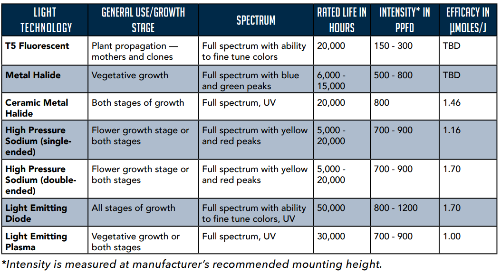
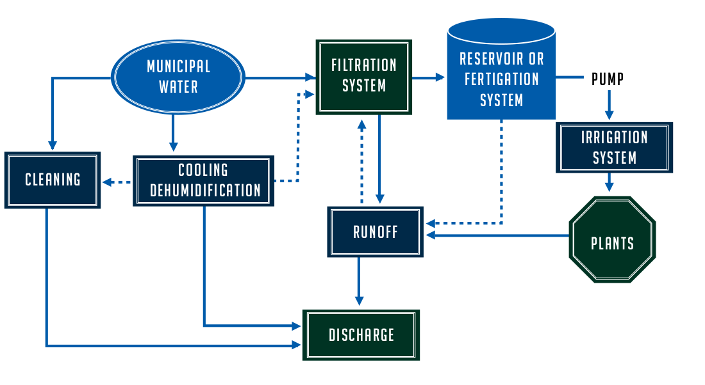
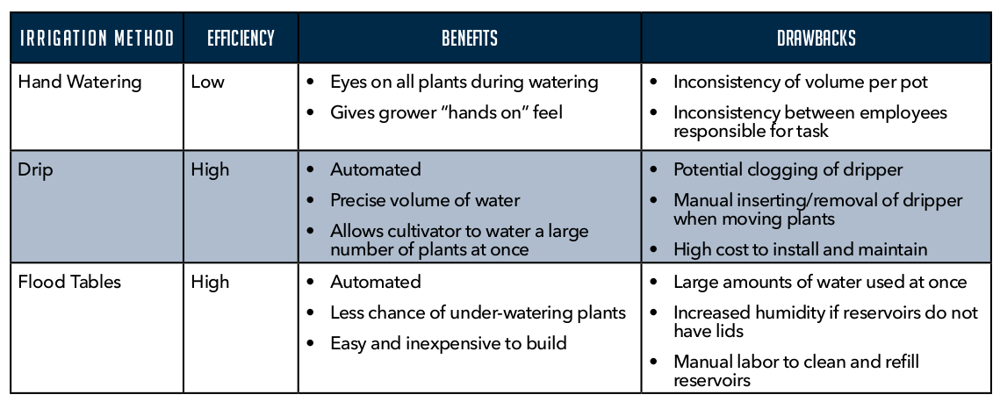
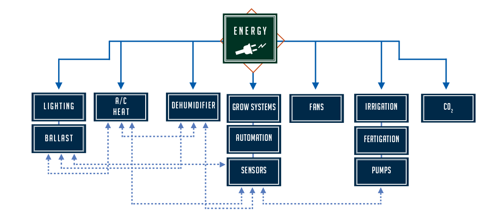
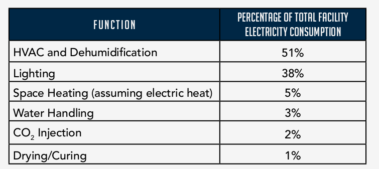

#Environmental Controls

This is an ongoing document for research conducted on environmental control solutions. Last edit 5.11.18. See bottom of page for future additions to this document. 
***

# HVAC

## Evaporative Cooling

* Heat is absorbed from the space through the evaporation of water, not ideal for cannabis cultivations due to the increase in humidity. 

## Mini Splits

* Ideal for very small facilities

* Quick owner installation at a low cost

* Useful for grows that are less than 1,000 sq-ft in size

* Lacks direct dehumidification control, indirectly lowers humidity

* Precise control of humidity control is not available

## Standard HVAC Systems

* Commonly referred to as rooftop units (RTU’s)

* Relatively inexpensive

* Components

    * Supply fan 

    * Filter

    * Compressor 

    * Condenser

    * Evaporator

* Challenges

    * Excessive duct work

    * Redundancy

    * Low temperatures

* Cons 

    * Poor performance and high energy bills due to misuse 

    * Microbial problems due to the inability to effectively manage cultivation environments

## Variable Refrigerant Flow

* Refrigerant based heat pump systems

* Most efficient for larger facilities, offering both redundancy and efficiency

* Componentes

    * One outdoor condensing unit

    * Multiple fan coil units (FCU) zones within facility

* Pros

    * Includes variable speed compressors and has the ability to vary cooling loads and variation in energy consumption. 

    * Heat can be redirected to cooling zones (vice-versa) to further aid in energy savings

* Cons

    * Expensive

    * Potential risk of leakage from refrigerant 

* Typically more useful in office environments where the loads vary due to the external environmental conditions rather than cultivation environments where the loads stay constant. 

## Chilled Water Systems

* Mechanism: 

    * A a packaged water cooling machine maintains a constant discharge water temperature from the water returning from the space - thereby removing BTU’s from the system.  The chilled water is then pumped indoors to distributed fan coils or air handlers throughout the space.

* Two main types

    * Air cooled -   can be located outdoors and move hot air to the ambient air

    * Water cooled - can be located indoor and move heat to a water chiller  

* Mainly used for the following:

    * Large scale buildings

    * Hospitals

    * Airports

    * Energy intensive manufacturing facilities

* Price point $$$$ not very economical for small and midsize operation, but very competitive for large scale operations 

* Pros

    * Highly efficient for large scale operations

    * The ability to isolate colutivation spaces without dedicated compressors for specific zones resulting in high a level of redundancy. 

    * High level of installation flexibility -- allows for changing capacity of any zone without the need to change the central system design

    * Dedicated dehumidification control when coupled with a reheat system *** ability to reduce humidity without sub-coolong the space. 

    * Has the ability to design redundant systems - if one system fails another can take over 

## Water cooled condensers

* Water cooled condensers create a more energy-efficient heat removal process through the condensers and can reduce operating costs substantially.

* Available for both typical air conditioning package units and chilled water systems

## Cooling towers & Geothermal systems

* Require more intensive maintenance and consume large amounts of water

* Typically not cost effective until the total load reaches 500 to 600 tons. 

* Onsite ponds and/or excavated geothermal loops can be useful in these cases, assuming the capacity for heat absorption is available. 

## NVAC 

* See Sprung (*placeholder for future research*)

    * Cycles air and utilizes thermodynamics 
    * NVAC systems can more tightly control microclimate spaces
    * Rather than circulating air through the length of the greenhouse, NVAC systems circulate air perpendicular through sections

* * *

# Lighting 

## Traditional: 

* T5 fluorescent

* Metal halide (MH)

* High pressure sodium (HPS) 

## New(er) technology:

* LED

* Light emitting plasma (LEP)

* Ceramic Metal Halide (CMH) 

## Influencing factors to consider:

* Age of fixture

* Bench height

* Plant height

## Key metrics

* Photosynthetically active radiation (PAR) 

    * Units: 

* Photosynthetic photon flux density (PPFD) - think PAR per square meter

    * Units: µmol/s-m2

## Supplemental equipment: 

* Reflectors

    * Increases PPFD 

## Best practices: 

* Utilize master controllers with quantum meters for 24-hour monitoring

* Ensure growers have access to handheld quantum meters for daily monitoring. 

***

# Irrigation

Process overview: 

## Filtration

*Per the Colorado State University Cooperative Extension, the following criterias should be analyzed prior to irrigation*

1. Total soluble salt content

2. Relative proportion of sodium cations (Na+) (compare to other cations) 

3. Excessive concentration of elements that cause toxicity

4. Bicarbonate anion (HCO3-) concentration as related to calcium (Ca++) plus magnesium (Mg++) cations.

## Water Treatment

* Carbon filtration system

    * Most efficient method to reduce contaminants 

    * very effective at achieving the desired nutrient load for cannabis plants when filtering is performed

    * Low levels of waste

## Methods and Automation

* Flood tables

* Aeroponics

* Wick systems

* NFT

* Water Culture

* Hand watering

* Drip watering 

Three most common methods 

## Electrical Conductivity

* Optimal EC levels

    * Veg: 1.0-2.5

    * Flowering: 2.0-4.0

Best practice: 

* Growers should test runoff periodically for salt build up.   
***

# Dehumidification 

*"...pay attention to performance curves — dehumidifiers are rated at Association of Home Appliance Manufacturers (AHAM) standards of 80 degrees and 60 percent humidity, but some manufacturers publish output at 86 degrees and 80 percent humidity, which can be misleading if it not being compared using a common reference."* **Denver Department of health - Best Management Practices**

## Stand Alone Systems

* Consists of small, free-hanging dehumidification units used to supplement the dehumidification gained from cooling systems during the light on periods and as a primary source of dehumidification during light off periods.  

* Consider pints per kWh when evaluating for efficiency

* Most affordable and easiest to integrate 

* Can be difficult to integrate with other climate control equipment. 

* More energy intensive than larger-scale dehumidification systems due to the use of small compressors

* Output is limited by temperature parameters (low temperatures = less output) 

## Reheat

* Heating a space to allow a cooling system to run 24hr a day in order to produce dehumidification without reducing temperatures

* Allows for more energy-efficient dehumidification via larger air compressors

* In some cases the energy required to heat may offset savings

* Can benefit the efficiency of standalone dehumidifiers by raising the temperature in the space. 

## Reheat Methods: 

### Electrical

* Utilizes electrical heat strips

* Electrical heat is not very efficient

* Should be compared to standalone dehumidifying systems in order to determine which system is most appropriate/efficient for facility

### Hot gas

* Heat removed from a space is rerouted to a reheat coil to be used to heat to neutral temperatures before returning to space

* Highly efficient

* Typically not recommended for in low-ambient conditions -- hard to manage refrigerant pressures 

* Additional standalone or re-heat from other sources should be used in conjunction with this. 

### Natural gas or propane

* Uses natural gas or propane, more advanced air handlers have this as an integration option.

### Hot water

* Highly efficient

* Common in chilled water systems

* Hot water supplied to fan coil units via a gas-fired boiler system

* Very precise 

### Heat recovery

* Highly efficient 

* Mostly used when water-cooled condensers are used in multiple rooms running opposite light cycles

* Heat removed from the lit room can be absorbed through the condenser and returned to the dark room

## Desiccant

* Highly efficient, but can be costly

* Mainly used in larger facilities (not sure the sq footage) 

* Requires the lowest amount of energy

## Economizers

* Using the outdoor environment to assist with managing the temperature of the indoor space. 

* Pose problems to CO2 enriched environments, Biosecurity and odor control 

## (Water-side) Economizer

* Can be used in both chilled water systems and water cooled condensing units

* Allow for free cooling without the need for ventilation

* When used in a chilled water system, the system can bypass the compressors all together when ambient conditions drop below 40F by utilizing the cold air to chill the water. 

* In certain climates, fluid coolers can be utilized in place of cooling towers for water cooled condensing units. 

* * *

# Air movement

## Destratification Fans

* Create vertical air flow and ensure that heat and humidity trapped in the plants canopy reach the ceiling

* Very energy-efficient method when ceilings are in excess of 10-feet

## Ventilation and CO2

* May be wasteful in C02 enriched environments

* Limiting this can be helpful in preventing contamination by reducing exposure 

## CO2 Generators

* Do not use for indoor facilities - results in high levels of wasted heat and can lead to dangerous working environments

## Bottled CO2

* Preferred method of enriching environments

***

# Energy Usage: 

* * *

# Useful Links: 

### Denver’s Department of Environmental Health (9/2017): 

[Cannabis Environmental Best Management Practice Guide](https://www.denvergov.org/content/dam/denvergov/Portals/771/documents/EQ/MJ%20Sustainability/Best%20Practices%20Management%20Guide%20web%20-%20final.pdf)

***

Things to add (future revisions):

* Greenhouses
* Greenhouse zones (i.e. veg/flower)
* NVAC systems
* Plenums used in NVAC systems
* NFT - for nutrients
* Irrigation Methods

