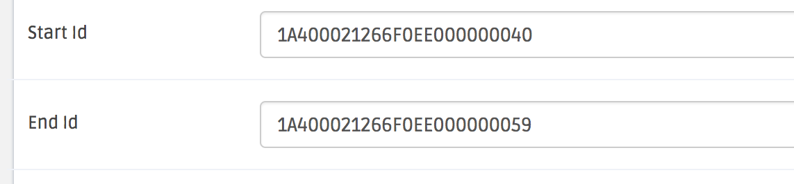
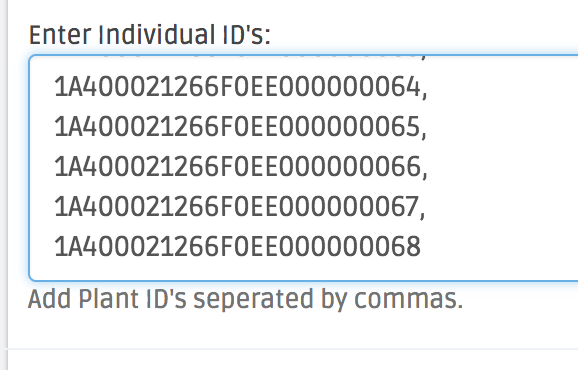

To create Plants, create a Harvest Batch with a Strain and Recipe. You can add Plants to a Batch at anytime so it's good to create planned Harvest Batches (without plants, but with a Strain/Recipe) and add your Plants with their tags once they hit soil, then complete the Plant Batch task. Plants can be created in two ways:

1. Plants can be created from a range using the last few digits of it's tag. Plant Groups (Batches) usually have tags in sequential order. The range below will create a Batch with 20 Plants with IDs as 1A400021266F0EE000000040, 1A400021266F0EE000000041, 1A400021266F0EE000000042, ... 1A400021266F0EE000000057, 1A400021266F0EE000000058, 1A400021266F0EE000000059.

2. Plants can also be created using a Comma Separated Variable format .csv. Using Excel or Google Sheets, copy an entire column of Plant IDs, export the selection to a .csv file, open the file and copy all of the rows into the Plant List text input pictured below.

