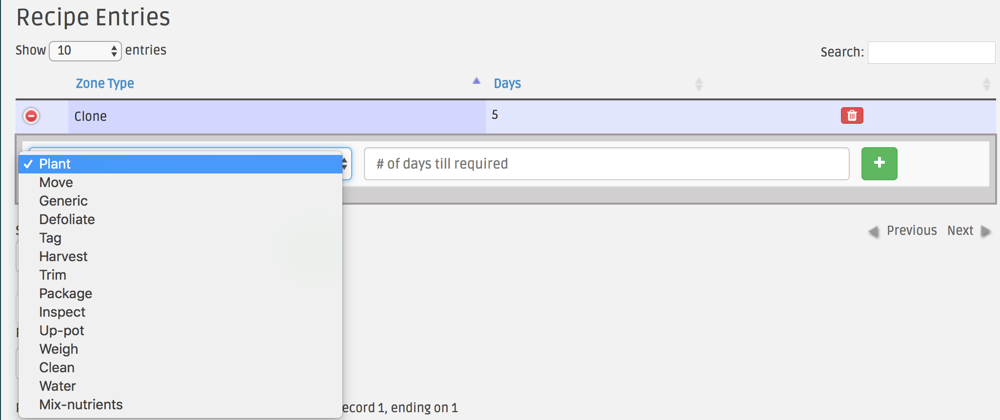

Users can now add tasks to to specific zones while creating recipes

After creating a harvest batch using the newly created recipe, the included tasks will automatically be generated

After adding a Zone to a recipe like usual, click the green plus sign to the left of the zone,

a pop-up will appear that will allow you to add details regarding the task itself

After adding the task details click the green plus sign in above screenshot to add task to this recipe