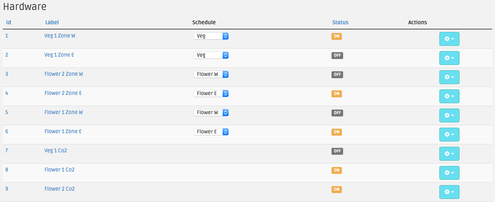

# Light Schedule

You can adjust the light schedule on a per light basis by going to your Hardware page, and selecting one of the four
pre-defined schedules from the select boxes.

Note that changing a schedule will not immediately affect the lights. So if you put a light that has it's schedule
set to 'None' to now be on the 'Veg' schedule, the light will not turn on until the next time that Veg lights are
scheduled to turn on. Conversely a light that is on will stay on if you turn give it a schedule of 'None'.

To affect the lights immediately, click the gear icon under the 'Actions' column, and select 'Turn On' or 'Turn Off'
respectively.

