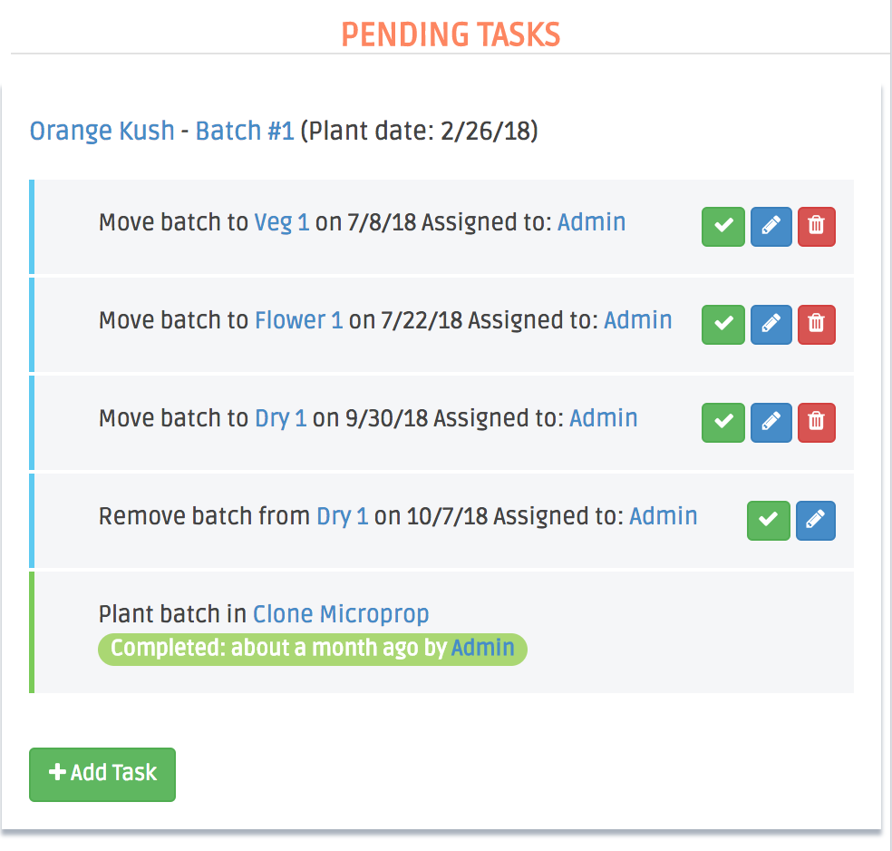

The Batch Workflow Panel is where all Batch Processes' happen (plant, move, and harvest).

Actionable buttons:

+ Add Task: This has two options...

1. Add another Move process to the Batch. This process creates a task for the batch to move it to a new zone. It's due date can only be between the Plant date and Harvest date for the Batch.

2. Add a Custom Task to the Batch. A custom task has no restrictions for due date or Zone, you can even leave these blank. E.g. auditing the batch could be completed at any time and when the batch is in any zone, but still needs to be created so that it's completion is tracked.

(Green Check Mark): This will complete the task. A confirmation will pop up asking you to confirm that this task is being completed 'now'. A task should be completed on the same day that the Batch was Planted, Moved, or Harvested (most often after leaving Flower for the last time, or after Trim, once the batch has entered Dry).

(Blue Pencil): This will allow you to edit the Zone, Date, and Assignee for the task.

(Red Trash Can): This will delete the task. Plant and Harvest Tasks cannot be deleted, but can be edited. If an entire Batch wasn't Planted or Harvested, it should be deleted from the Batch Index page. If only a handful of Plants from the Batch were Planted, you can delete the un-planted Plants or create a new Batch.