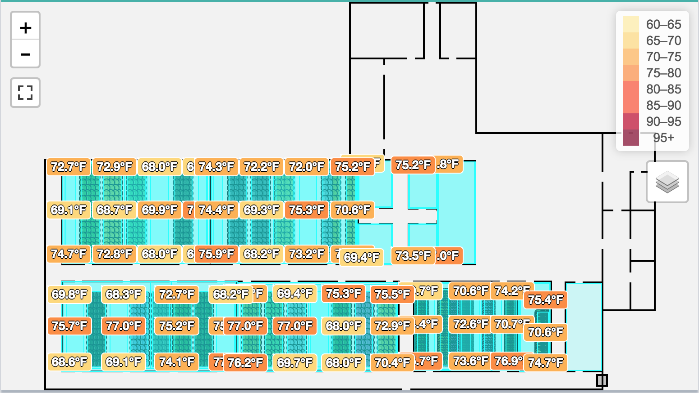
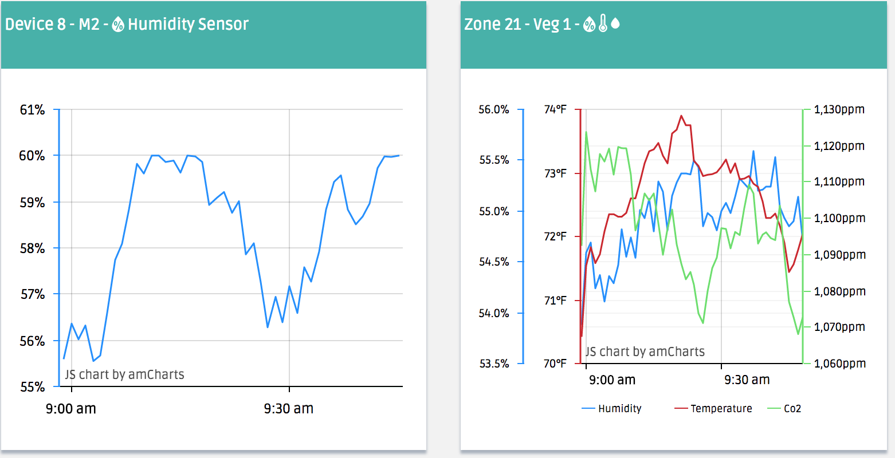
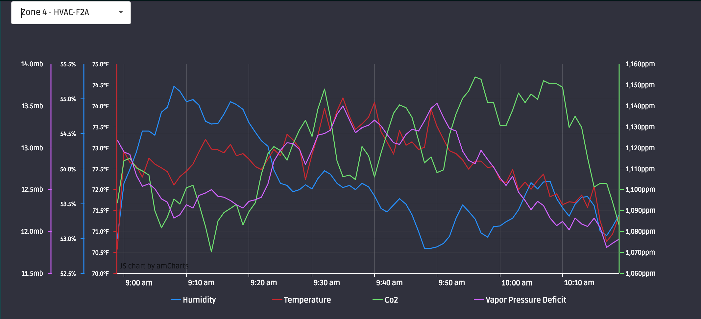

Data visualization is available is 3 different areas: the dashboard map, dashboard charts, and the charts page.

# Dashboard Map

The dashboard map lets you view real-time environment data from a top-down floorpan perspective. Live plants, zone labels, device statuses, and more can be found here. Zoom and Fullscreen controls are in the top left. Gradients and layer controls are in the top right.

# Dashboard Charts

Dashboard charts give you a view of the last 12 hours of environment data and update in real-time. Hover over the green title bar and click the blue 'Edit' button to change the chart's configuration. A Device chart (left) shows you a single Sensor's data. A standard Device has 5 sensors but occasionally it will have more (e.g. a PAR sensor). Type in the dropdown to find the sensor you want faster. A Zone chart (right) by default shows you the average Humidity (blue), Temperature (red), and Co2 (green) across all sensors in that room. Thresholds can be added to either chart.

# The Charts Page

Click 'Charts' on the left Nav bar to access the charts page. There are Device and Zone charts available just like the dashboard charts, except these have a much longer timeframe and do not update in real time. Clicking and dragging anywhere on the chart will let you zoom in. Click/hover over one of the data types at the bottom to exclude/include that data. As well, these charts have additional data types like Vapor Pressure Deficit.